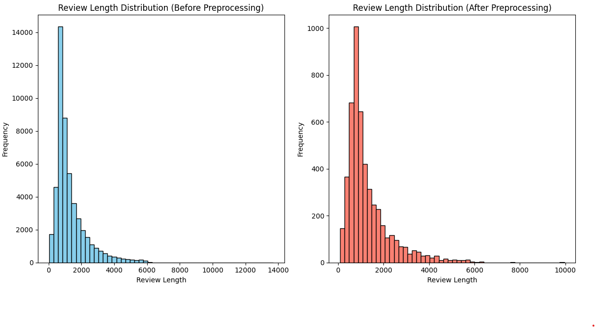
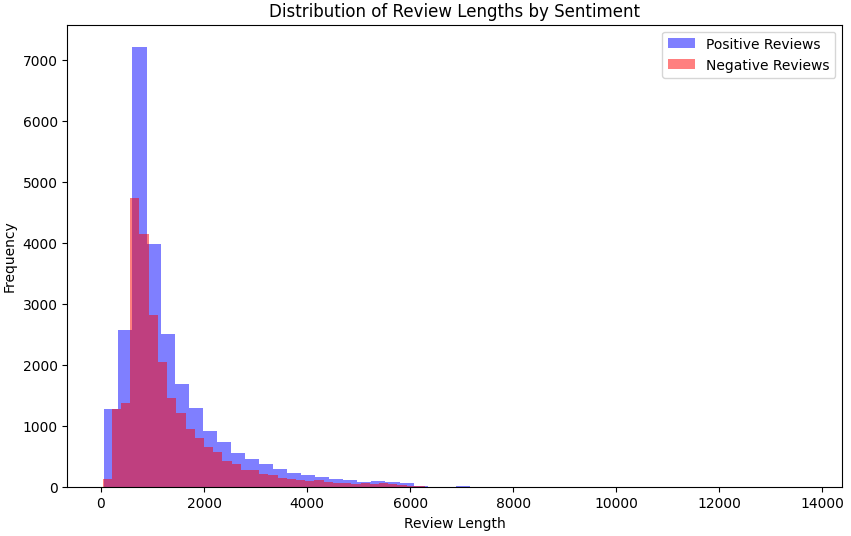
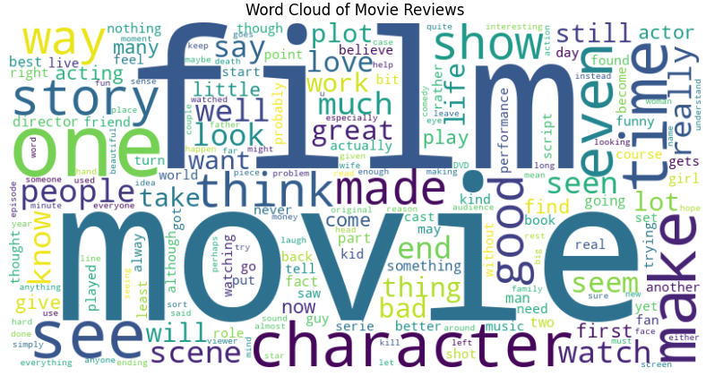
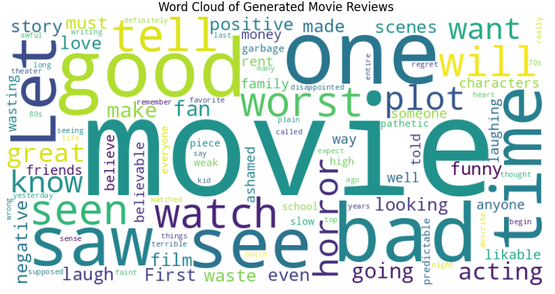
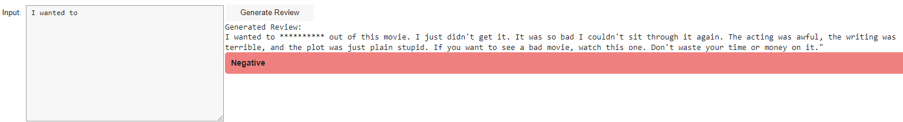
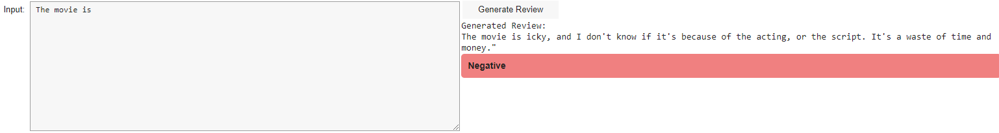
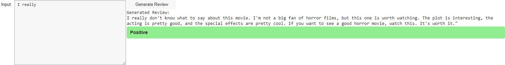
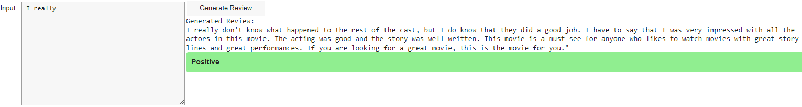

# Deep Learning–Based Generation of Realistic and Diverse Textual Movie Reviews from IMDb Data

## Project Overview

This project aims to develop and use sophisticated deep learning methods to produce realistic and varied human-sounding text movie reviews using the IMDb dataset. We have leveraged the transformer-based GPT-2 model due to its extensive abilities to understand and generate text language. Our goal was to create a model that could generate text reviews as similar as possible to human-written reviews in terms of variance, complexity, length, and naturalness.

## Table of Contents

- [Introduction](#introduction)
- [Background and Related Work](#background-and-related-work)
- [Methods](#methods)
  - [Data Pre-processing](#data-pre-processing)
  - [Choosing Model Architecture](#choosing-model-architecture)
  - [Training Techniques](#training-techniques)
  - [Evaluation Metrics](#evaluation-metrics)
  - [Generation and Fine-Tuning](#generation-and-fine-tuning)
  - [Qualitative and Quantitative Analysis](#qualitative-and-quantitative-analysis)
- [Implementation](#implementation)
- [Experimental Results](#experimental-results)
  - [Review Length Analysis](#review-length-analysis)
  - [Sentiment Distribution in Data](#sentiment-distribution-in-data)
  - [Word Cloud Analysis](#word-cloud-analysis)
  - [Training Metrics](#training-metrics)
  - [Model Performance and Evaluation](#model-performance-and-evaluation)
  - [Manual Evaluation](#manual-evaluation)
- [Conclusion](#conclusion)
- [References](#references)
- [Links](#links)

## Introduction

Natural Language Processing (NLP) has a major impact on industries and society. This project focuses on generating realistic textual movie reviews as close as possible to human-sounding text using the IMDb dataset. The main goal is to push the frontiers of automated textual generation for improved capabilities.

## Background and Related Work

The project builds on the foundational techniques of text generation, especially transformer-based architectures like GPT-2, which have set new benchmarks in NLP. We reviewed multiple architectures and selected GPT-2 for its ability to generate coherent and diverse textual material.

## Methods

### Data Pre-processing

We cleaned the text, performed tokenization, and, if needed, removed punctuation and stop words. Stemming or lemmatization was used to reduce vocabulary complexity while maintaining the model's understanding.

### Choosing Model Architecture

We selected GPT-2 for its self-attention mechanism, which allows for generating fluent and coherent sentences. The model's architecture enables it to generate human-like text sequences.

### Training Techniques

We used stochastic gradient descent (SGD) and Adam optimization, along with appropriate learning rate schedules and regularization approaches, to train the model. Performance measures like loss and validation accuracy were monitored during training.

### Evaluation Metrics

We used BLEU and ROUGE metrics to evaluate the quality and diversity of generated reviews. These metrics assess the similarity between generated reviews and human-authored references.

### Generation and Fine-Tuning

We used sampling approaches like temperature-based sampling and greedy decoding to generate reviews. Techniques like beam search and nucleus sampling were employed to increase coherence and variety.

### Qualitative and Quantitative Analysis

We performed both automated and human evaluations to assess the realism, coherence, and diversity of the generated reviews. This thorough evaluation ensured the effectiveness of our methodology.

## Implementation

The project involved extensive data preparation, model selection, training, and evaluation. The complete project code and model are hosted on GitHub.

## Experimental Results

### Review Length Analysis

We analyzed the distribution of review lengths before and after preprocessing. The preprocessing steps significantly improved training efficiency.

### Sentiment Distribution in Data

We observed a bifurcation in data due to sentiment, with positive reviews being shorter than negative ones. This skew in data was accounted for in the model training.

### Word Cloud Analysis

Word clouds provided insights into the range of vocabulary and themes in the dataset and generated reviews.

### Training Metrics

The final training and validation losses indicated an efficient learning process without overfitting.

### Model Performance and Evaluation

We used BLEU and ROUGE scores, as well as human evaluations, to assess the quality of generated reviews. The model succeeded in producing structurally correct, contextually rich, and emotionally evocative reviews.

### Manual Evaluation

Human evaluations showcased the model's ability to generate diverse and realistic movie reviews.

### Samples

## Conclusion

The project demonstrated the power of the GPT-2 model in creating realistic and varied textual movie reviews. Future work will focus on further fine-tuning and expanding the model's capabilities.

## References

Refer to the project report for detailed references to the related work and methodologies used in this project.

## Links

- [IMDb Dataset](https://www.kaggle.com/code/lakshmi25npathi/sentiment-analysis-of-imdb-movie-reviews/input)
